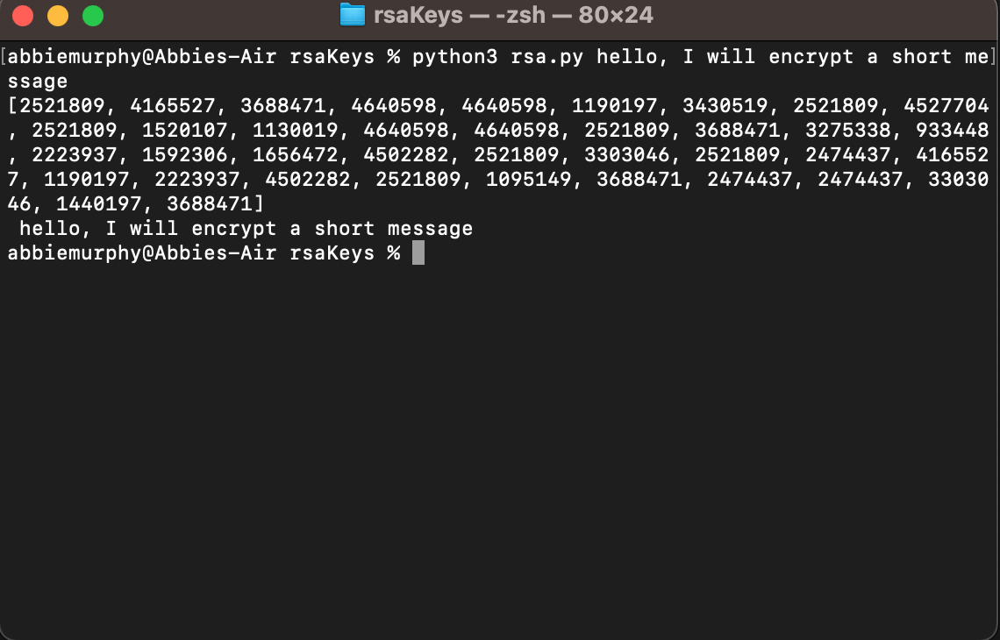
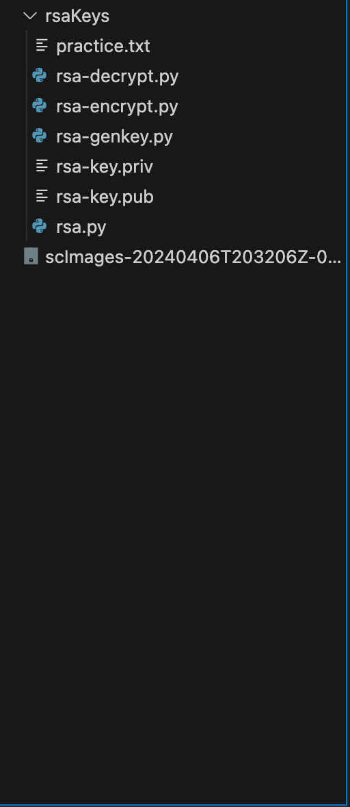
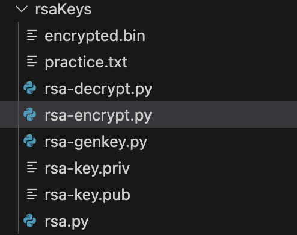
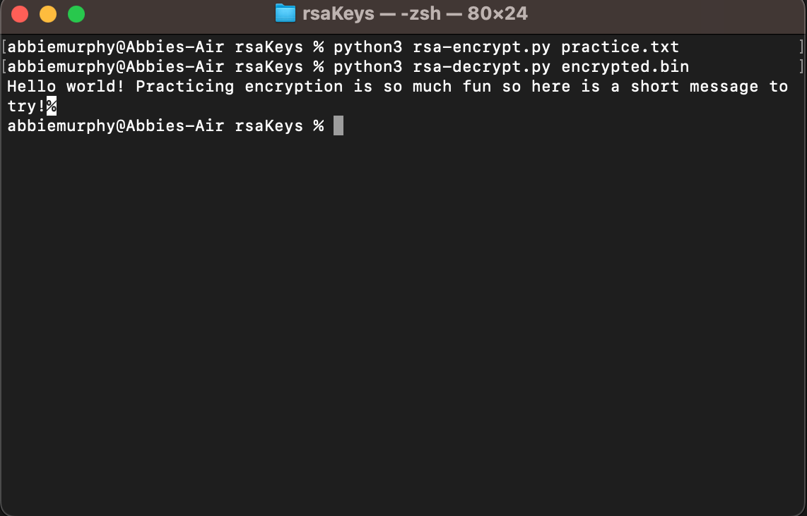

# Cryptography-Exploration
Expiriments and exploration with cryptography in python.

## rsa.py

After learing some basics of encryption in a class, I decided to try and see how the random numbers could contribute to encryption and after some research created a program that will encrypt small messages from the commandline using random numbers.

## rsa-genkey.py

Next, I explored some of the python cryptography tools. This program automatically generates a public and private key pair once run, adding files to the project rsa-key.pub and rsa-key.priv.

## rsa-encrypt.py

From here, I made a file to encrpyt called practice.txt that has a short enough message and also leaves room for padding. It will output a file encrypted.bin with the encrypted message. To execute it takes in the file name in the commandline: python3 rsa-encrypt.py practice.txt.

## rsa-decrypt.py

Now rsa-decrpyt.py will take a file name in the commandline argument as python3 rsa-decrypt.py encrpyted.bin, and print the decrypted message to the console. 

